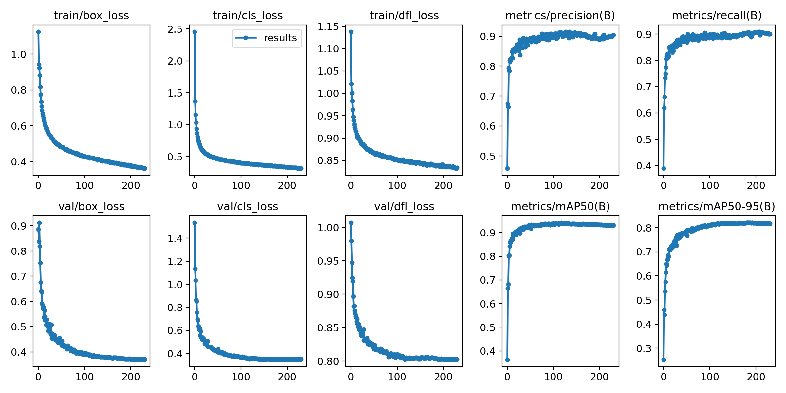

### 利用yolov8对中文文档图片进行版面检测

#### 模型下载、训练及推理
本项目根据开源中文版面数据[CDLA](https://github.com/buptlihang/CDLA)  ，利用yolov8训练两个模型8mpt与8npt，

CDLA是一个中文文档版面分析数据集，面向中文文献类（论文）场景。包含以下10个label：

|正文|标题|图片|图片标题|表格|表格标题|页眉|页脚|注释|公式|
|---|---|---|---|---|---|---|---|---|---|
|Text|Title|Figure|Figure caption|Table|Table caption|Header|Footer|Reference|Equation|

8mpt模型与8npt模型下载：

链接：https://pan.baidu.com/s/1YakM5AYrakoG9hYN-w7mJw 

提取码：j2za

训练：
```
from ultralytics import YOLO

def train_model():
    # 加载模型
    print('model load。。。')
    model = YOLO("8npt/best.pt")  # 加载模型
    print('model load completed。。。')
    #使用模型
    model.train(data="img-layout.yaml", epochs=300, device=1)# , lr0=0.0001)  # 训练模型
    metrics = model.val()  # 在验证集上评估模型性能
```

<br/>
<p align="center">
  <a>
    
    
  </a>
</p>
<br/>

推理：
```
from ultralytics import YOLO
def infer():
    model = YOLO('8npt/best.pt')
    results = model('img.jpg')
    print(results[0].plot())
    cv2.imwrite('result.png', results[0].plot())
```

#### contact

1、github：https://github.com/jiangnanboy

2、博客：https://www.cnblogs.com/little-horse/

3、邮件:2229029156@qq.com

#### reference
https://github.com/ultralytics/ultralytics

https://github.com/buptlihang/CDLA

